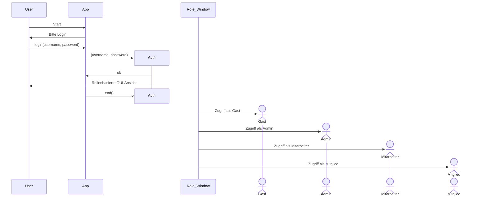
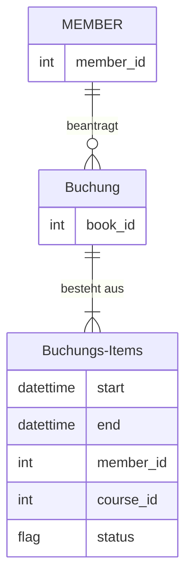
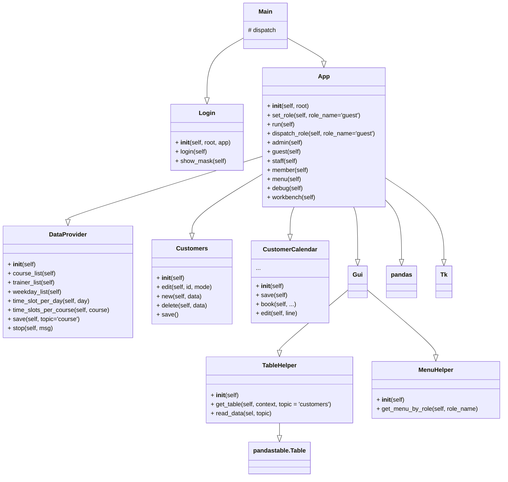
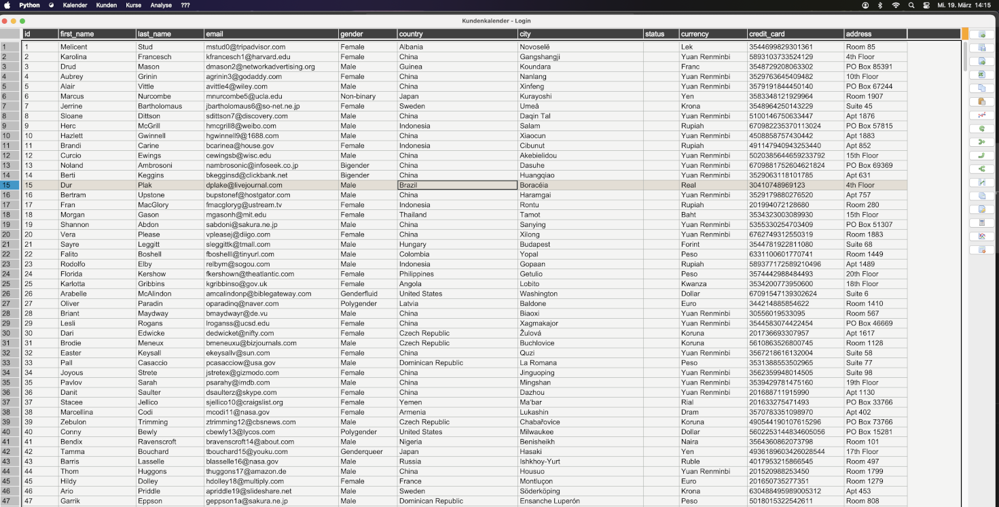

## Anwendung Sequenzdiagramm Anmeldung bis rollenbasierter GUI

```mermaid
sequenceDiagram
    User->>App: Start # Start der Applikation
    App->>User: Bitte Login
    User->>App: login(username, password)
    create participant Auth
    App->>Auth: (username, password)
    Auth->>App: ok
    Role_Window->>User: Rollenbasierte GUI-Ansicht
    destroy Auth
    App-xAuth: end()
    
    create actor G as Gast
    Role_Window->>G: Zugriff als Gast
    create actor A as Admin
    Role_Window->>A: Zugriff als Admin
    create actor S as Mitarbeiter
    Role_Window->>S: Zugriff als Mitarbeiter
    create actor M as Mitglied
    Role_Window->>M: Zugriff als Mitglied

    
    
```

## "Mini-ER" - Beispiel Buchung

```mermaid
erDiagram
MEMBER ||--o{ Buchung: "beantragt"
    MEMBER {
        int member_id
    }
    Buchung ||--|{ Buchungs-Items:  "besteht aus"
    Buchung {
        int book_id
    }
    Buchungs-Items  {
        datettime start
        datettime end
        int member_id
        int course_id
        flag status
    }

```

## Klassendiagramm 

```mermaid
classDiagram

 
    
    class Main{
        # dispatch
    }

    class Login{
        + __init__(self, root, app)
        + login(self)
        + show_mask(self)
    }

    class App{
        + __init__(self, root)
        + set_role(self, role_name='guest')
        + run(self)
        + dispatch_role(self, role_name='guest')
        + admin(self)
        + guest(self)
        + staff(self)
        + member(self)
        + menu(self)
        + debug(self)
        + workbench(self)
   }

    class DataProvider{
        + __init__(self)
        + course_list(self)
        + trainer_list(self)
        + weekday_list(self)
        + time_slot_per_day(self, day)
        + time_slots_per_course(self, course)
        + save(self, topic='course')
        + stop(self, msg)
    }

    class Customers{
        + __init__(self)
        + edit(self, id, mode)
        + new(self, data)
        + delete(self, data)
        + save()
    }

   class CustomerCalendar{
        + __init__(self)
        + save(self)
        + book(self, ...)
        + edit(self, line)
        ...
   }

   class TableHelper{
    + __init__(self)
    + get_table(self, context, topic = 'customers')
    + read_data(sel, topic)
   }

   class MenuHelper{
    + __init__(self)
    + get_menu_by_role(self, role_name)
}

    class Gui{
    
    }

    Main --|> App
    Main  --|> Login

    App  --|> CustomerCalendar
    App  --|> Customers
    App  --|> DataProvider
    App --|> Gui

    App  --|> pandas
    App  --|> Tk
    Gui --|> MenuHelper
    Gui --|> TableHelper
    TableHelper --|> pandastable.Table


```

## Screenshots

