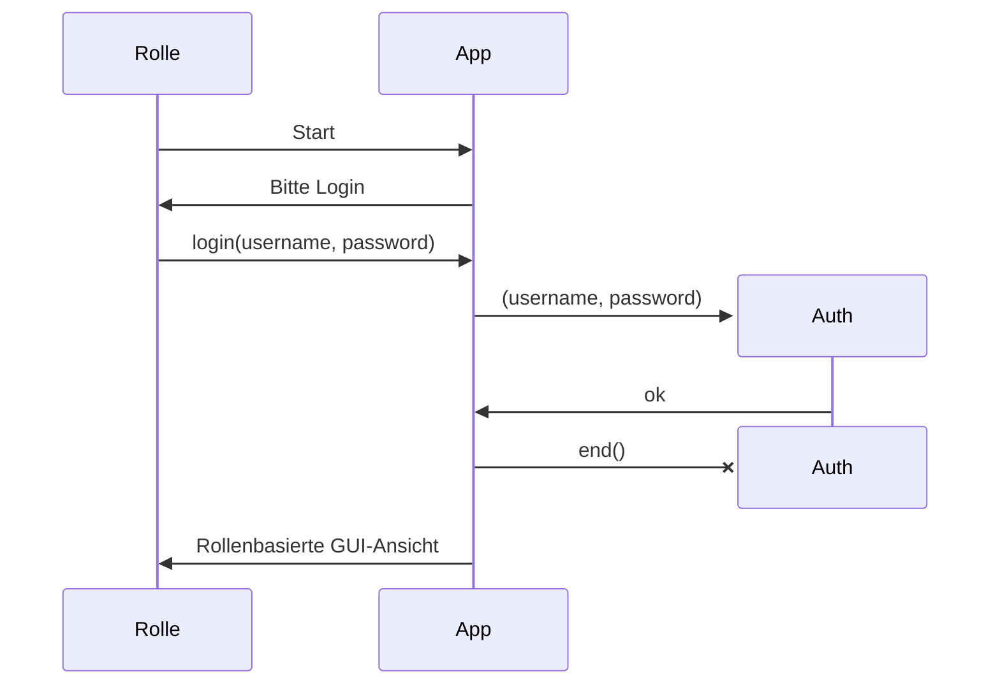
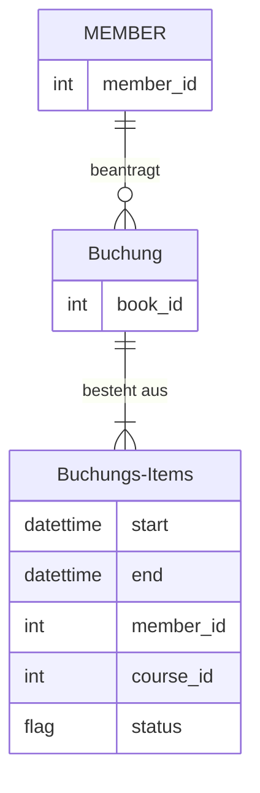
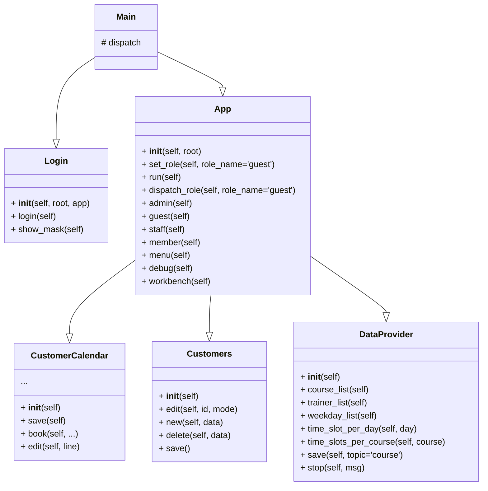
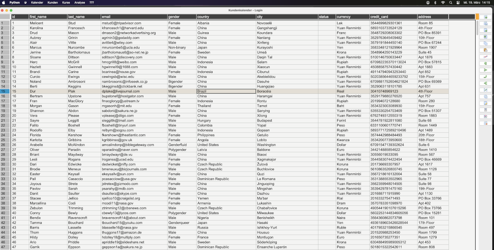

## Anwendung Sequenzdiagramm Anmeldung

```mermaid
sequenceDiagram
    Rolle->>App: Start # Start der Applikation
    App->>Rolle: Bitte Login
    Rolle->>App: login(username, password)
    create participant Auth
    App->>Auth: (username, password)
    Auth->>App: ok
    destroy Auth
    App-xAuth: end()
    App->>Rolle: Rollenbasierte GUI-Ansicht
    
```

## Beispiel Buchung

```mermaid
erDiagram
MEMBER ||--o{ Buchung: "beantragt"
    MEMBER {
        int member_id
    }
    Buchung ||--|{ Buchungs-Items:  "besteht aus"
    Buchung {
        int book_id
    }
    Buchungs-Items  {
        datettime start
        datettime end
        int member_id
        int course_id
        flag status
    }

```

## Klassendiagramm 

```mermaid
classDiagram

 
    
    class Main{
        # dispatch
    }

    class Login{
        + __init__(self, root, app)
        + login(self)
        + show_mask(self)
    }

    class App{
        + __init__(self, root)
        + set_role(self, role_name='guest')
        + run(self)
        + dispatch_role(self, role_name='guest')
        + admin(self)
        + guest(self)
        + staff(self)
        + member(self)
        + menu(self)
        + debug(self)
        + workbench(self)
   }

    class DataProvider{
        + __init__(self)
        + course_list(self)
        + trainer_list(self)
        + weekday_list(self)
        + time_slot_per_day(self, day)
        + time_slots_per_course(self, course)
        + save(self, topic='course')
        + stop(self, msg)
    }

    class Customers{
        + __init__(self)
        + edit(self, id, mode)
        + new(self, data)
        + delete(self, data)
        + save()
    }

   class CustomerCalendar{
        + __init__(self)
        + save(self)
        + book(self, ...)
        + edit(self, line)
        ...
   }

    Main --|> App
    Main  --|> Login

    App  --|> CustomerCalendar
    App  --|> Customers
    App  --|> DataProvider

```

## Screenshots

